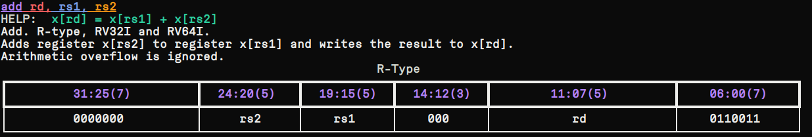

# INTRODUCTION

Simple utility for referencing the RISC-V ISA, formats, instructions and registers informations.


# INSTALLATION

## PREREQUISITE
- Depends on >=python3.8
- Install `rich` python package `pip3 install rich`

## PACKAGE INSTALLATION
```
git clone https://github.com/pathakraul/riscv-isa-help
cd riscv-isa-help
chmod 777 riscvisa
```
Add the path into the PATH env variable or directly run using `./`.

# USAGE

```
./riscvisa -f <R|I|S|U|B|J|all>

./riscvisa -i <instruction>

```


# EXAMPLE
```
./isa.py -i add 

```



# TODO

- [ ] Add registers support
- [ ] Add support to take more than one instruction or registers as input.
- [ ] Improve explanation of instructions and registers
